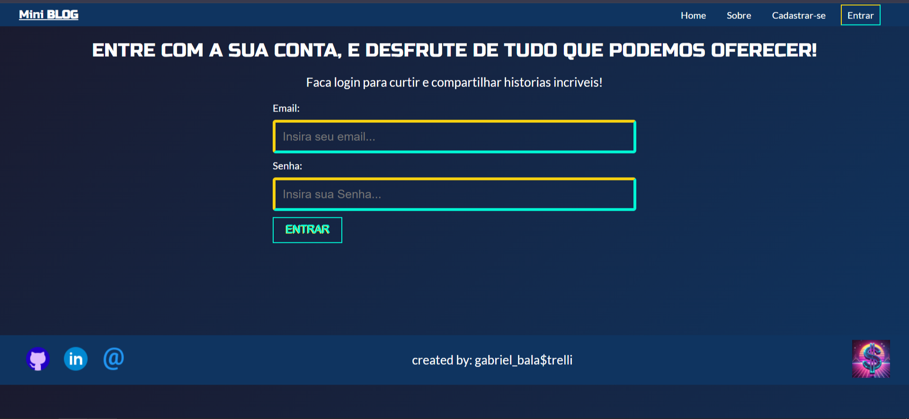
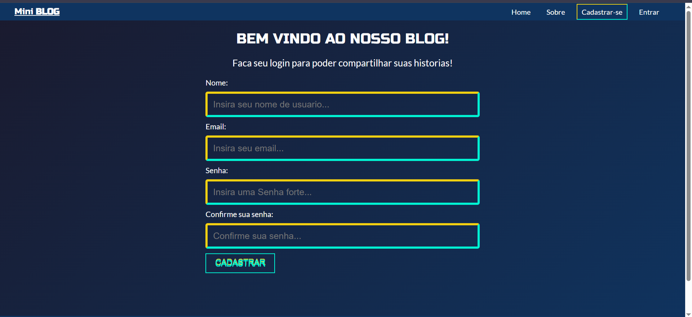
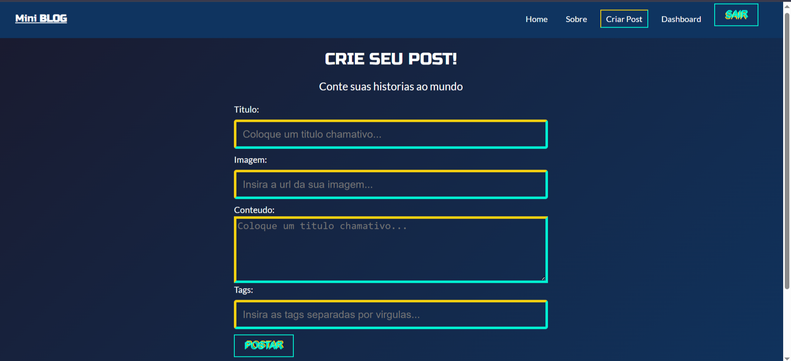
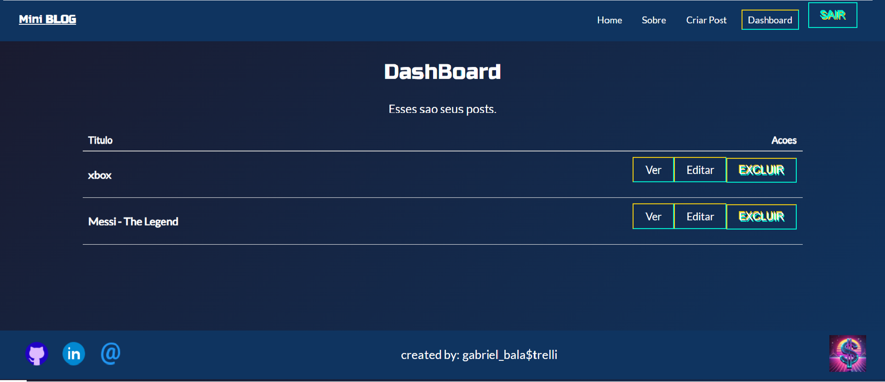

# 📝 Mini Blog

Um projeto de **blog moderno e funcional** desenvolvido com **JavaScript + React**, que utiliza **Firebase** como backend para autenticação e banco de dados em tempo real. Para fins de estudo.

---

## 📚 Descrição

O **Mini Blog** é uma aplicação web onde usuários podem criar contas, fazer login, publicar artigos e gerenciar suas próprias postagens. O sistema possui **controle de rotas públicas e privadas**, permitindo que apenas usuários autenticados tenham acesso a funcionalidades como **criar postagens**, **editar** ou **excluir conteúdo** e **acessar o painel de controle (dashboard)**.

> Tudo isso construído com **React**, **CSS**, **React Router DOM** e integração total com **Firebase**.

---

## 🚀 Tecnologias utilizadas

- ⚛️ **React**
- 🧠 **JavaScript (ES6+)**
- 🌐 **HTML5**
- 🎨 **CSS3 / CSS Modules**
- 🔥 **Firebase (Authentication + Firestore)**
- 📦 **React Router DOM**

---

## 🔐 Funcionalidades

- ✅ Cadastro de usuários
- 🔓 Login e Logout com Firebase Auth
- 🔐 Áreas privadas acessíveis apenas após login
- 📝 Criação, edição e exclusão de postagens
- 📂 Dashboard exclusivo para o usuário logado
- 🌍 Visualização pública das postagens por qualquer visitante

---

## 🖼️ Prints da aplicação

### 🔹 Página Inicial


### 🔹 Cadastro


### 🔹 Criar Post


### 🔹 Dashboard


---

## 🎬 Demonstração em GIF


---

## 📦 Como rodar localmente

```bash
# Clone o repositório
git clone https://github.com/GabrielBalastrelli/mini_blog.git

# Acesse a pasta
cd mini_blog

# Instale as dependências
npm install

# Inicie o servidor de desenvolvimento
npm start
